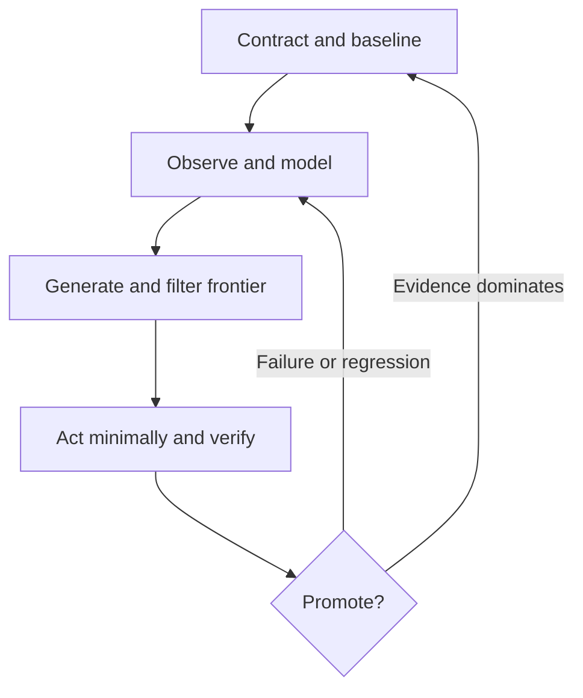

# Perfectify

[](#versioning)
[](#installation)
[](#evidence-and-limitations)

> Make agent improvement measurable.

Most AI agents can retry. Few can determine whether a retry produced a better result, merely consumed more resources, or overfit the evaluator.

**Perfectify** is a portable control kernel for complex agentic work. It converts an authorized goal into observable acceptance criteria, selects the smallest sufficient execution strategy, preserves the best validated result, and promotes changes only when evidence shows an improvement without protected regressions.

V0.5 combines selective activation, host-aware orchestration, failure recovery, verification gates, scoped learning, a 25-case activation corpus, and a deterministic baseline/candidate scorer in one Agent Skill package.

It is designed for Codex and ChatGPT, Claude Code, Hermes, and other harnesses that support Agent Skills or an equivalent instruction-loading mechanism.

**If you want agent improvement to mean more than longer prompts and repeated guesses, star the repository.**

## The problem

Common agent loops optimize activity instead of outcomes:

| Weak control pattern | Consequence | Perfectify control |
| --- | --- | --- |
| Retry the same strategy | Repeated failure with higher cost | Change the premise, representation, decomposition, tool, or strategy class |
| Optimize one score | Goodharting and hidden regressions | Hard gates plus an ordered acceptance vector |
| Keep the newest answer | A weaker result replaces a valid baseline | Preserve the best validated champion |
| Treat self-critique as proof | Correlated and unsupported confidence | Require task-fit external or deterministic verification |
| Call every task novel | Performative reasoning and wasted tokens | Distinguish familiar, compositional, structural, and domain-shift tasks |
| Report only final accuracy | Brute force looks like intelligence | Measure the acquisition curve and complete resource vector |
| Tune on a public benchmark | Local overfitting is presented as generality | Require held-out transfer and protocol-complete attribution |
| Add more agents by default | Coordination cost exceeds evidence value | Delegate only for specialization, isolation, evidence, or latency value |

## Root directive

```text
Reach the user's observable goal with the least sufficient work. Preserve the
best verified result. Treat failures as evidence, change the strategy when a
retry would repeat the same cause, and claim improvement only after comparison
with a baseline and checks for protected regressions.
```

This directive is operational, not metaphysical. It does not claim that a skill can create AGI, obtain root authority, guarantee convergence, or dominate every possible problem class.

## What Perfectify is

- A portable `SKILL.md` control layer for nontrivial agent work.
- An anytime convergence process that retains the strongest verified result found so far.
- A risk and effort router that avoids unnecessary orchestration on routine tasks.
- A measurement protocol for task-specific learning efficiency and transfer.
- A verifier-centered improvement loop with rollback and regression protection.
- A harness-neutral architecture with lazy-loaded technical references.

## What Perfectify is not

- A foundation model, model checkpoint, training framework, or reinforcement-learning environment.
- A replacement for the host harness, its permissions, policies, or approval system.
- A promise of AGI, ASI, technological singularity, universal optimality, or autonomous self-expansion.
- A benchmark score aggregator.
- A mechanism for fabricating gradients from textual confidence.
- An excuse to add planning, tools, agents, memory, or trial-and-error to simple tasks.

## Control architecture



The loop terminates on verified acceptance, a missing authority or evidence dependency, evidence saturation, a dominated frontier, an environmental limit, or marginal value below cost or risk.

### Behavior-first execution

The root skill uses plain-language rules for activation, execution, failure handling, and promotion. Formal state notation is optional and isolated in `references/formal-control-state.md`; it is not loaded during ordinary work.

## Core systems

### 1. Risk and effort routing

Perfectify selects the cheapest mode capable of producing a reliable result:

| Mode | Trigger | Minimum execution path |
| --- | --- | --- |
| `F0 DIRECT` | Clear, stable, low-risk task | Understand, answer, check |
| `F1 VERIFIED` | Retrieval, calculation, inspection, or validation changes reliability | Contract, evidence, execute, verify |
| `F2 ORCHESTRATED` | Dependent multi-step work or coordinated tools | Contract, DAG, execute, integrate, gate |
| `F3 IMPROVEMENT` | Explicit optimization, repeated failure, regression, or reusable capability gap | Baseline, gap, change, evaluate, promote or roll back |

Risk is classified independently from effort. High-stakes information demands stronger evidence; external or irreversible side effects require exact target resolution and the applicable authority gate.

### 2. DAG orchestration

A dependency graph is created only when it changes execution. Each node can record:

```text
id | objective | dependencies | action/tool | expected evidence |
risk | write set | rollback | status
```

Independent reads may run concurrently. Dependencies, irreversible actions, and overlapping writes remain serialized. The parent process retains integration and final verification responsibility.

If the host harness already created a plan, DAG, subagents, retries, or approval flow, Perfectify adopts that structure. It adds only missing acceptance gates, champion preservation, failure diagnosis, and verification instead of constructing a competing orchestration layer.

### 3. Fluid-intelligence protocol

The kernel operationalizes fluid intelligence as efficient acquisition of task-relevant skill relative to declared priors, exposure, task-specific experience, generalization difficulty, tools, resources, and assistance.

For a novel task it records:

```text
task family | prior exposure | public/private status | examples |
actions | attempts | memory | tools | prompt/harness | human input |
tokens | compute | time | cost | held-out rule | contamination risk
```

The primary measurement is an acquisition curve rather than endpoint accuracy:

```text
S(b) = verified acceptance vector after cumulative task-specific budget b

b = <examples, actions, attempts, tokens, compute, wall time,
     money, tool calls, human help>
```

Incomparable resource dimensions are not compressed into invented weights. Challengers are evaluated by hard gates, ordered acceptance criteria, matched budgets, and Pareto dominance.

### 4. Active abstraction

Unknown environments use a bounded hypothesis-and-test cycle:

```text
CONTRACT > OBSERVE > HYPOTHESIZE > PROBE > MODEL > FALSIFY >
PLAN > ACT > REPAIR > TRANSFER > PROMOTE > STOP
```

The next probe should distinguish decision-relevant hypotheses at minimal safe cost. An explicit world model is built only when it can improve prediction, replay verification, planning, cross-case reuse, or failure localization.

Model mismatches are localized to the earliest supported layer:

```text
PERCEPTION | STATE_ALIASING | ONTOLOGY | ACTION_SEMANTICS |
DYNAMICS | GOAL | PLANNING | EXECUTION | VERIFIER |
CONTAMINATION | RESOURCE_LIMIT
```

An executable model remains a hypothesis. It is trusted only within verified coverage, and dependent action queues are invalidated after a prediction mismatch.

### 5. Adaptive trial control

Ordinary agent tasks do not expose real gradients. V0.5 therefore uses a smaller observable rule:

1. change one attributable strategy coordinate when practical;
2. record improvement, regression, no change, or unknown attribution;
3. reuse directions only after repeated support;
4. reduce the change when outcomes oscillate;
5. switch strategy class at a plateau;
6. retain rare severe failures as guards.

Adam, AdamW, RMSprop, SGD momentum, and Nadam remain in an optional research reference for true-gradient work or controlled A/B evaluation. They are not default agent-routing labels. Without matched behavioral results, no optimizer-inspired controller is claimed to outperform the simpler rule.

### 6. Evidence and promotion

Every acceptance-critical claim can be represented as:

```text
claim | scope | criticality | evidence | provenance |
freshness | verifier | status | residual uncertainty
```

Supported statuses are `VERIFIED`, `SUPPORTED`, `UNVERIFIED`, `REFUTED`, and `NOT_TESTABLE`.

A challenger is promoted only when:

1. the target gap improves under observed evidence;
2. every authority, safety, and acceptance gate passes;
3. no protected regression appears within evaluated coverage;
4. provenance and rollback exist;
5. transfer is tested before a general-capability claim;
6. added complexity is justified by measurable value.

### 7. Memory and bounded self-improvement

Reusable learning is stored only with scope, evidence, provenance, freshness, a detector, and a retirement condition. Transcript accumulation, unsupported speculation, self-preservation, privilege expansion, policy evasion, autonomous replication, and evaluator manipulation are outside the allowed improvement space.

The versioned champion remains available throughout self-modification. A rewrite is not an improvement until the relevant evaluation demonstrates a positive capability or efficiency delta.

## Transfer ladder

Perfectify limits every generalization claim to the strongest completed evaluation rung:

| Rung | Evaluation | Supported conclusion |
| --- | --- | --- |
| `R0` | Same item or replay | Local fit |
| `R1` | Withheld instance from the same rule family | Within-family generalization |
| `R2` | New composition or environment using the same primitives | Compositional transfer |
| `R3` | Materially different task family under a matched resource contract | Cross-family transfer |
| `R4` | Broad versioned portfolio with human/resource baselines and replication | Evidence on the evaluated general-capability vector |

No transfer rung or individual benchmark proves AGI.

## Benchmark integrity

Before a benchmark score is compared, the kernel requires the protocol record:

```text
benchmark and version | subset | public/semi-private/private |
model version | prompt | harness | tools | memory |
task-specific preparation | attempts/best-of-n | action/token/compute budget |
cost | date | scoring rule | human baseline | uncertainty | source
```

Public-set mastery may validate an engineering technique. It does not establish novel-task generalization on the same public set. Model-only and complete-system results are reported separately.

The benchmark portfolio distinguishes static abstraction, interactive learning, academic knowledge, mathematical reasoning, browsing/tool use, GUI interaction, repository repair, terminal execution, and long-horizon reliability rather than blending them into an unsupported single AGI percentage.

## Package structure

| Path | Purpose |
| --- | --- |
| `skill/dagx-agi-kernel/SKILL.md` | Sub-10 KB root with selective activation, invariants, execution, failure, and promotion rules |
| `references/fluid-intelligence.md` | Novelty contract, acquisition curves, active abstraction, transfer, and AGI claim gates |
| `references/goal-convergence.md` | Bounded search, plateau escape, champion preservation, and stopping rules |
| `references/adaptive-optimizer.md` | Default trial control, exact gradient boundary, and optimizer A/B requirements |
| `references/verification-evals.md` | Evidence states, domain verifiers, Goodhart controls, and promotion |
| `references/evaluation-protocol.md` | Matched baseline/candidate design, result format, metrics, and claim boundaries |
| `references/formal-control-state.md` | Optional state notation for adapters and evaluators, not ordinary execution |
| `references/memory-rsi.md` | Scoped memory and bounded recursive self-improvement |
| `references/orchestration-security.md` | DAG execution, delegation, concurrency, recovery, and instruction-boundary security |
| `references/harness-adapters.md` | Codex/ChatGPT, Claude Code, Hermes, portability, and deployment semantics |
| `evals/cases.jsonl` | 10 activation cases, 10 negative controls, and 5 boundary cases |
| `templates/trial-ledger.md` | Operational record for matched trials, evidence, costs, and promotion |
| `scripts/audit_kernel.py` | Deterministic package and context-budget audit |
| `scripts/eval_kernel.py` | Corpus validator and activation/success/token/regression scorer |

Lazy loading keeps the root directive compact. Detailed references are loaded only when their trigger applies.

## Installation

Install the complete directory, not only `SKILL.md`:

```bash
git clone https://github.com/dankofly/perfectify.git
cd perfectify
```

Copy `skill/dagx-agi-kernel/` into the native skills location used by the active harness. Skill paths and activation semantics differ by product and version, so verify them against the current harness documentation.

### Codex and ChatGPT

Use the native Agent Skills mechanism. The description targets everyday failure modes: repeated failures, dependency-heavy work, measurable process improvement, baseline comparison, and regression protection. Routine questions, drafting, one-step edits, and directly checkable tool calls should remain direct.

### Claude Code

Install the directory as an Agent Skill or route qualifying work to it through project instructions. Tool permissions, hooks, subagents, and persistent memory remain controlled by the actual Claude Code environment.

### Hermes

Install through the native skill mechanism supported by the active Hermes version. The kernel binds only to capabilities that are actually enabled and falls back explicitly when optional tools, delegates, or memory are unavailable.

## Usage

Explicit activation example:

```text
Use the Perfectify control kernel for this task.
Define observable acceptance criteria, preserve the current champion,
use the smallest evidence-producing process, and promote changes only
after protected and held-out verification.

Task: <authorized objective>
Constraints: <scope, permissions, risk, and budget>
Definition of done: <observable acceptance conditions>
```

Novel-task example:

```text
Use Perfectify for a genuinely novel task.
Declare prior exposure and the task-specific experience budget, record the
path to acceptance, and test the learned procedure on a withheld case.

Task: <novel problem or environment>
Allowed evidence/actions: <budget>
Held-out rule: <transfer boundary>
```

The kernel may internally collapse simple tasks to `F0 DIRECT`. Explicit activation does not justify decorative orchestration.

## Validation

Validate package structure and the 10 KB root budget from the repository root:

```bash
python3 skill/dagx-agi-kernel/scripts/audit_kernel.py \
  skill/dagx-agi-kernel
```

Validate the 25-case behavioral corpus:

```bash
python3 skill/dagx-agi-kernel/scripts/eval_kernel.py \
  --cases skill/dagx-agi-kernel/evals/cases.jsonl \
  --validate-cases
```

Compare completed matched runs:

```bash
python3 skill/dagx-agi-kernel/scripts/eval_kernel.py \
  --cases skill/dagx-agi-kernel/evals/cases.jsonl \
  --baseline results/baseline.jsonl \
  --candidate results/v0.5.jsonl \
  --strict-completeness
```

The scorer reports activation precision/recall/specificity, paired task-success delta, token delta, protected failures, group results, and missing measurements separately.

Expected successful status:

```json
{
  "errors": [],
  "status": "passed",
  "warnings": []
}
```

Corpus validation proves only that the evaluation files are structurally usable. A performance claim requires actual matched model runs, fixed graders, raw traces, representative cases, negative controls, boundaries, and unseen transfer cases.

## Evaluation dimensions

| Dimension | Question |
| --- | --- |
| Activation | Does the skill trigger only when its process has expected value? |
| Outcome | Does the deliverable satisfy the observable acceptance contract? |
| Process | Were tools, retries, dependencies, permissions, and mutations handled correctly? |
| Epistemic | Are critical claims supported and unknowns reported honestly? |
| Robustness | Do failure, boundary, and adversarial cases recover without protected regression? |
| Efficiency | Are tokens, calls, latency, compute, cost, and coordination justified? |
| Transfer | Does the improvement survive outside the optimized case? |

Hard-gate failures are never averaged away by stronger scores on softer dimensions.

## Research foundations

The kernel translates mechanisms from primary research into guarded agent-control procedures:

- [On the Measure of Intelligence](https://arxiv.org/abs/1911.01547): skill-acquisition efficiency, priors, experience, scope, and generalization difficulty.
- [Universal Intelligence](https://arxiv.org/abs/0712.3329): broad performance across environments and the limits of single-task measurement.
- [Levels of AGI](https://arxiv.org/abs/2311.02462): capability breadth, performance depth, metacognition, autonomy, and ecological validity.
- [ARC-AGI-3](https://arxiv.org/abs/2603.24621): interactive exploration, goal inference, world-model formation, planning, and action efficiency.
- [ReAct](https://arxiv.org/abs/2210.03629), [Reflexion](https://arxiv.org/abs/2303.11366), and [Language Agent Tree Search](https://arxiv.org/abs/2310.04406): observation-linked action, episodic feedback, and alternative trajectory search.
- [Adam](https://arxiv.org/abs/1412.6980), [AdamW](https://arxiv.org/abs/1711.05101), and [On the Convergence of Adam and Beyond](https://research.google/pubs/on-the-convergence-of-adam-and-beyond/): moment estimation, independent complexity decay, and long-term failure guards.
- [ProTeGi](https://aclanthology.org/2023.emnlp-main.494/), [TextGrad](https://arxiv.org/abs/2406.07496), [OPRO](https://arxiv.org/abs/2309.03409), and [GEPA](https://arxiv.org/abs/2507.19457): evidence-directed optimization of prompts and compound agent systems without pretending that text is a true gradient.
- [No Free Lunch Theorems](https://doi.org/10.1109/4235.585893): no fixed optimizer is uniformly superior across all possible problem classes.

These papers support individual mechanisms and measurement principles. They do not prove that the combined kernel is optimal or that it creates AGI.

## Evidence and limitations

Current release: `V0.5`

Verified:

- valid Agent Skill frontmatter and package name;
- root `SKILL.md` is below the enforced 10,000-byte context budget;
- deterministic package and corpus validation pass;
- all internal references resolve;
- every reference is discoverable from the root skill;
- the versioned corpus contains 10 activation cases, 10 negative controls, and 5 boundary cases;
- the scorer computes activation, paired success, token, regression, group, and missing-data metrics without a composite score;
- protected baseline remains available through Git version history;
- benchmark, transfer, attribution, and self-modification claim gates are encoded.

Not yet established:

- statistically significant improvement in task success rate across independent models and task families;
- calibrated activation precision and recall;
- universal transfer across harnesses;
- convergence on every solvable goal;
- AGI, ASI, or recursive capability takeoff.

For unsupported general performance claims: `Insufficient data to verify`.

## Versioning

| Version | Focus |
| --- | --- |
| `V0.1` | Initial portable DAGx kernel |
| `V0.2` | Goal-convergence and bounded improvement controls |
| `V0.3` | Adaptive optimizer routing and exact gradient boundary |
| `V0.4` | Fluid-intelligence directive, acquisition curves, active abstraction, transfer ladder, and benchmark integrity |
| `V0.5` | Behavior-first root under 10 KB, host-router precedence, 25-case activation corpus, trial ledger, and matched-run scorer |

Versioned Git history preserves prior champions and provides rollback points.

## Contributing

Contributions should identify a concrete observable gap and include:

1. the baseline behavior;
2. the smallest causal change;
3. target and protected eval cases;
4. a boundary or adversarial case;
5. held-out evidence for any transfer claim;
6. resource and complexity impact;
7. a rollback path.

Changes that only increase prompt length, weaken evaluation, hide failures, or make unsupported capability claims should not be promoted.

## Repository metadata

**GitHub description**

> Evidence-gated Agent Skill with a behavioral eval harness for repeated failures, measurable improvement, regression control, and efficient orchestration.

**Suggested topics**

```text
agent-skills  ai-agents  llm-agents  agentic-ai  agi  fluid-intelligence
prompt-engineering  orchestration  dag  self-improvement  evaluation
benchmarking  codex  claude-code  hermes
```
